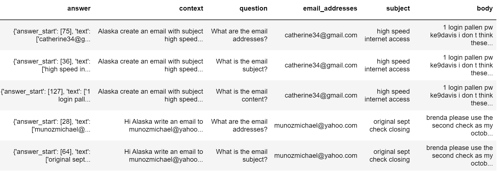
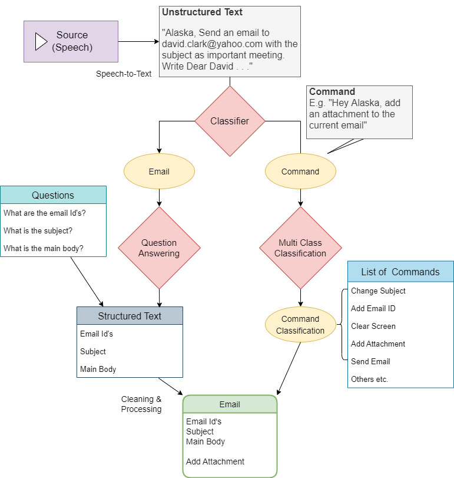

# Alaska Email Assistant
##### Digital Email Assistant which send emails via voice

### Data Files
###### Note:
 
> Download the files mentioned below <br>
> and add them in the same hierarchy of folders. <br>
> The keys folder is not available for public use.
<br>
Data/ <br>
Models/Span_Bert/model_weights/ <br>
GloVe/ <br>

[Link Here](https://drive.google.com/drive/folders/1Tss-bNXzfccGlJpFzdcCR5dkTQK3kAQd)

### Set Up

1. Install virtualenv
```shell
pip install virualenv
virtualenv alaskaEnv
```
2. Activate virtualenv
```shell
source download.sh
```
3. Install dependencies
```shell
pip install -r requirements.txt
```
4. Run Python Install.py to download libraries
```shell
python install.py
```
4. Go to App >> Web App and Run Model
```shell
flask run
```

### Data Snapshot

### Model Architecture

### Platform


### Email Successfully sent


